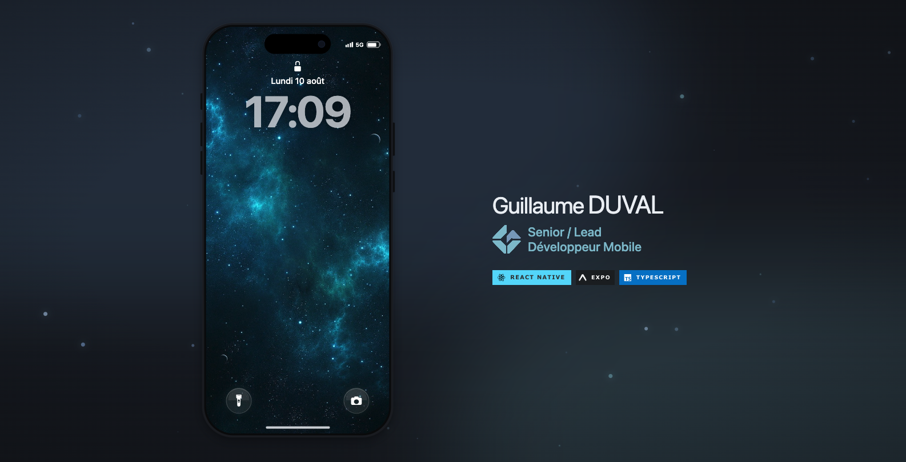
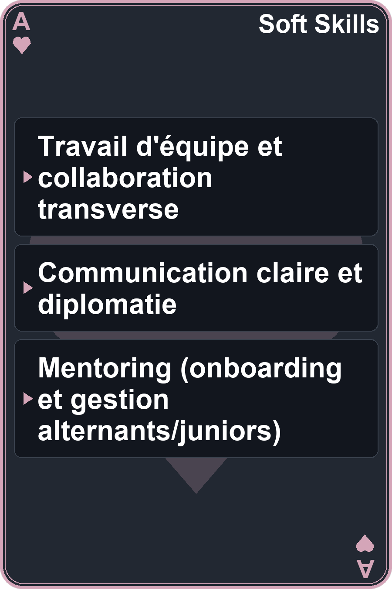
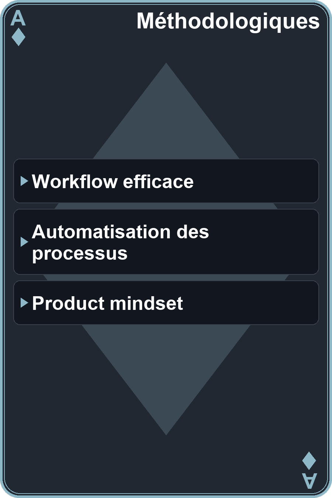
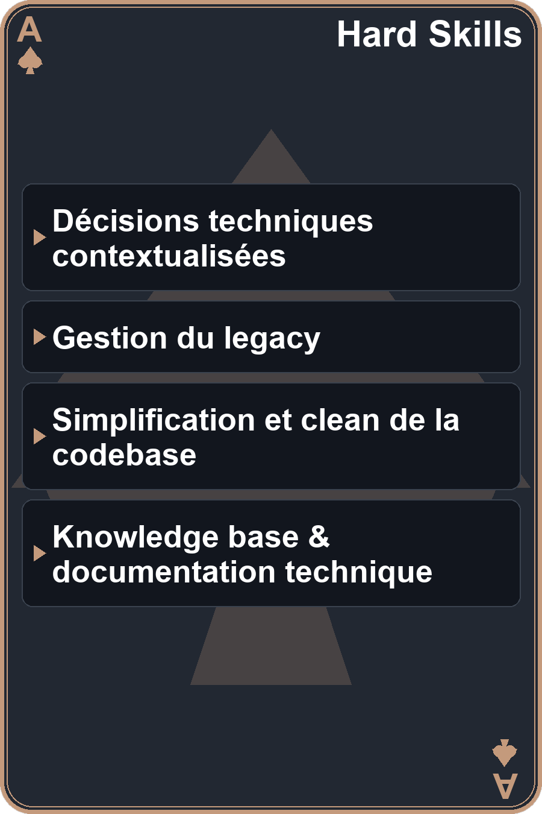
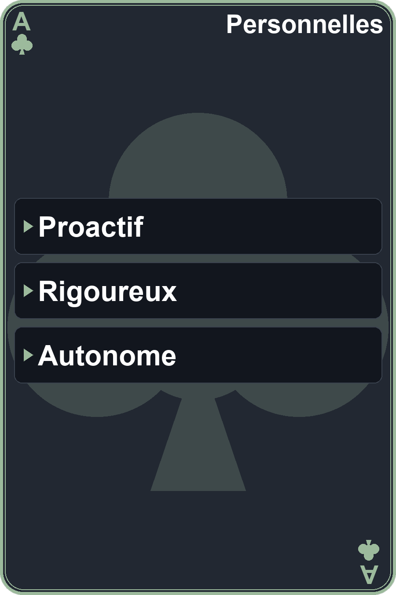

  

 

  
  &nbsp;
  
  &nbsp;
  

 

<h3 style="font-size: 20px; font-weight: bold">Hello 👋 Je m'appelle Guillaume D. et je suis Lead / Senior Développeur Mobile</h3>

- 📍 Basé à Nantes (France)
- 💻 13+ années d'expérience en dévelopement, dont:
  - 📱 6+ années d'expérience en dévelopement Mobile
  - 🌐 7 années d'expérience en dévelopement Web (fullstack et front)
- 🚀 Plus d'infos sur le <a href="https://guillaume.guvalapps.com/">Portfolio</a>
- 👨🏻‍💻 J'ai notamment contribué ou dirigé le développement des apps mobile:
  -  Hustle Up [<a href="https://apps.apple.com/fr/app/hustle-up/id6450982235">iOS</a>/<a href="https://play.google.com/store/apps/details?id=com.healthtech.hustleup">Android</a>] - Fitness/Crossfit
  -  Dougs [<a href="https://apps.apple.com/fr/app/dougs/id1154867586">iOS</a>/<a href="https://play.google.com/store/apps/details?id=com.dougs.compta">Android</a>] - Expert comptable en ligne
  -  Nickel [<a href="https://apps.apple.com/fr/app/nickel-compte-pour-tous/id1119225763">iOS</a>/<a href="https://play.google.com/store/apps/details?id=com.fpe.comptenickel">Android</a>] /  BNP Paribas - Néo banque

<h3 style="font-size: 20px; font-weight: bold">Compétences</h3>

<table align="center">
  <tr>
    <td align="center"></td>
    <td align="center"></td>
    <td align="center"></td>
    <td align="center"></td>
  </tr>
</table>

<h3 style="font-size: 22px; font-weight: bold">Stack Tech</h3>

Technos / services (spé mobile) 

&nbsp;

&nbsp;

&nbsp;

&nbsp;
 
BaaS 
 
Langages 

&nbsp;
 
IA / IDE 

&nbsp;
 
Linters 

&nbsp;

&nbsp;
 
Data 

&nbsp;

&nbsp;
 
Testing 

&nbsp;

&nbsp;

&nbsp;
 
Debug 

&nbsp;

&nbsp; 
UX / UI 

&nbsp;

&nbsp;

&nbsp;
 
Versioning / CI-CD 

&nbsp;

&nbsp;

&nbsp;
 
Tracking / Marketing 

&nbsp;

&nbsp;

&nbsp;

&nbsp;

&nbsp;
 
Internationalisation 

&nbsp;

&nbsp;
 
Package Manager 

&nbsp;
 
Doc 

<h3 style="font-size: 22px; font-weight: bold">Autres</h3>

&nbsp;
&nbsp;
&nbsp;
&nbsp;
&nbsp;
&nbsp;
&nbsp;
&nbsp;
&nbsp;
&nbsp;
&nbsp;
&nbsp;
&nbsp;
&nbsp;
&nbsp;
&nbsp;
&nbsp;
&nbsp;
&nbsp;
&nbsp;
&nbsp;
&nbsp;
&nbsp;
&nbsp;
&nbsp;
&nbsp;
&nbsp;
&nbsp;
&nbsp;
&nbsp;
&nbsp;
&nbsp;
&nbsp;
&nbsp;
&nbsp;
&nbsp;
&nbsp;
&nbsp;
&nbsp;
&nbsp;
&nbsp;

